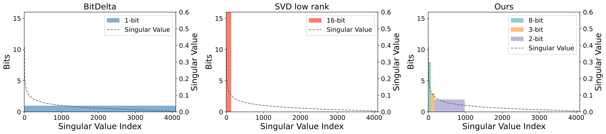
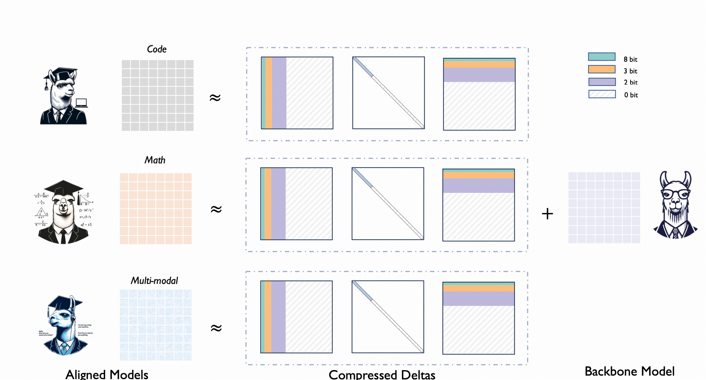

# Delta-CoMe: Training-Free Delta-Compression with Mixed-Precision for Large Language Models

The official repository containing the code for our NeurIPS 2024 paper. 



<p align="center">
  <a href="#-news">| 🔥 News</a> |
  <a href="#-quick-start">💡 Quick start</a> |
  <a href="#-method">🌈 Method</a> |
  <a href="#-experimental-results">🧪 Results |</a> |
  <a href="#-citation">📓 Citation</a> 
</p>

# 🔥 News
- Oct 2024: We release our code.
- Sep 2024: Our paper has been accepted by NeurIPS 2024.

# 💡 Quick Start
## Install
```
conda create -n Delta-CoMe python=3.9

conda activate Delta-CoMe

pip install -r requirements.txt 
```
## Compression
We release both llama and mistral series models. See llama.py and mistral.py for more details.
```
bash run.sh  # to run llama series models, see run.sh for more specific details
```
## Eval
```
See ./evaluation for for more details.
```

# 🌈 Method
Delta-CoMe proposes mixed precision for delta compression inspired by the long-tail distribution of singular values in the delta weights which allocate different bits for different singular vectors.



# 🧪 Experimental Results
Contrary to the conventional low-bit or low-rank methods, Delta-CoMe can maintain performance in many tasks like math, code, even multi-modal.
| Method      | α    | WizardMath GSM8K | WizardMath MATH | MagicoderS-CL HumanEval | MagicoderS-CL MBPP | Llama-2-chat SafetyBench | Llama-2-chat TruthfulQA | Llava-v1.5 GQA | Llava-v1.5 TextVQA | Ave. |
|-------------|------|------------------|-----------------|-------------------------|-------------------|--------------------------|-------------------------|----------------|--------------------|------|
| Backbone    | 1    | 11.0             | 2.9             | 38.4                    | 47.6              | 41.7                     | 38.9                    | n/a            | n/a                | n/a  |
| Aligned     | 1    | 55.2             | 10.9            | 70.7                    | 69.2              | 59.5                     | 44.6                    | 62.0           | 58.2               | 53.5 |
| Low-Rank    | 1/16 | 43.2             | 8.0             | 56.7                    | 65.7              | 55.4                     | 42.5                    | 57.7           | 53.3               | 47.8 |
| BitDelta    | 1/16 | 45.6             | 8.6             | 57.3                    | 65.9              | 59.3                     | 41.1                    | 59.7           | 56.9               | 49.3 |
| Delta-CoMe  | 1/16 | **53.6**         | **10.3**        | **67.1**                | **67.9**          | **59.8**                 | **47.0**                | **61.7**       | **58.5**           | **53.2** |


# 🔬 TODOs
We will release the code in the following order, please stay tuned!

- [x] Release core code of Delta-CoMe.
- [ ] Integrate all the evaluation scripts.
- [ ] Release the packing function and kernel related to Delta-CoMe.

# 📓 Citation
If you find our repo is helpful, please cite the following 
```bibtex
@inproceedings{ping2024deltacome,
      title={Delta-CoMe: Training-Free Delta-Compression with Mixed-Precision for Large Language Models}, 
      author={Bowen Ping and Shuo Wang and Hanqing Wang and Xu Han and Yuzhuang Xu and Yukun Yan and Yun Chen and Baobao Chang and Zhiyuan Liu and Maosong Sun},
      booktitle={Thirty-eighth Conference on Neural Information Processing Systems}
      year={2024},
}
```